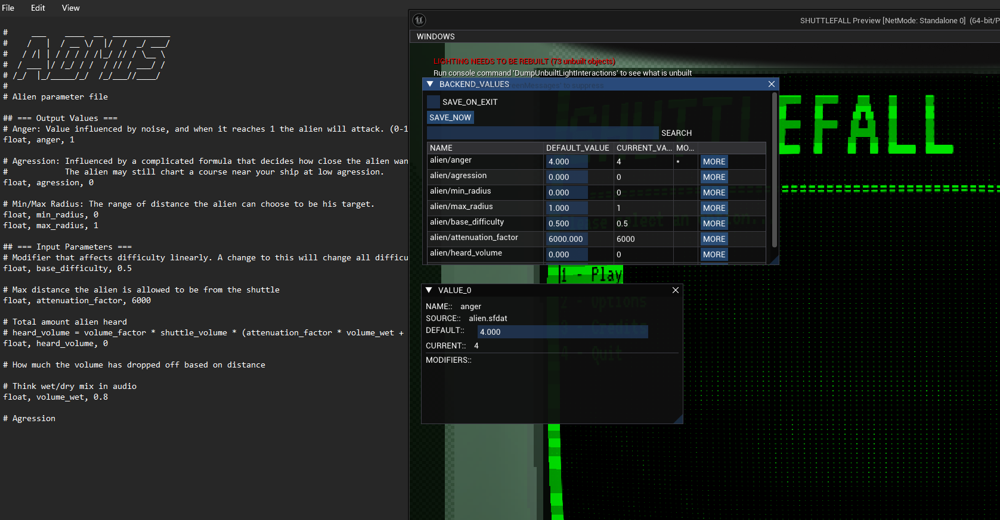

+++
title = "Internal Unreal tools for our upcoming game SHUTTLEFALL"
date = "2025-11-09"
hideComments=true
tags = ["projects", "unreal-engine"]
+++
## Statistics tracker

Statistics for each individual session are automatically saved to a CSV file, and can be reloaded into the tool to see data at a particular time.

## Value tracker

This is a re-implementation of a Godot tool I had made for a separate project to track values that must keep track of multiple modifiers.
- Values are stored within accessible text files, but can also be modified and saved directly from the tool